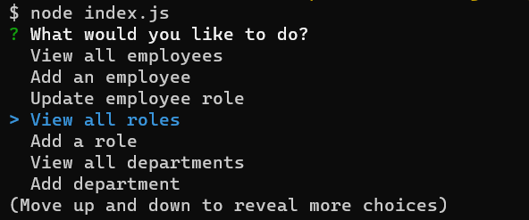
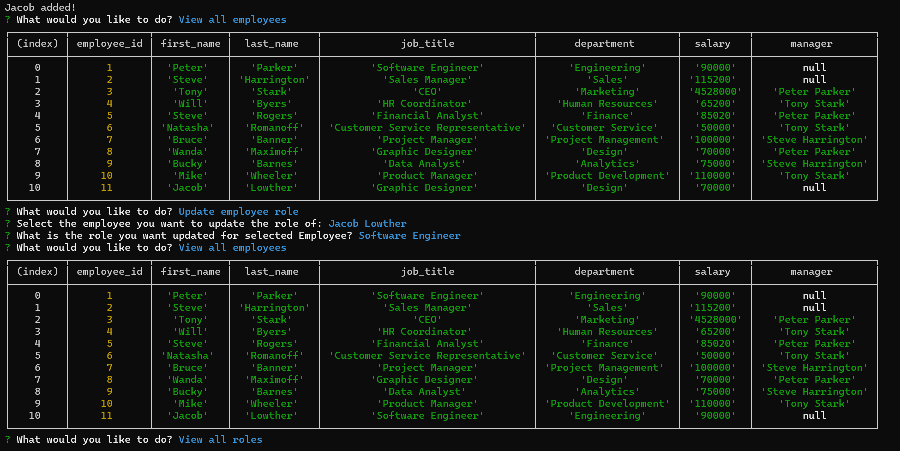

# Business Manager

This is a project that allows you to manage your employees by using inquirer for prompts and mysql2 to connect your database to the terminal.

## Usage
To use this command line interface you:

First have to clone this repository

Second load up your MySQL workbench or whatever you use to create databases

Third copy everything in:

    schema.sql

and:

    seeds.sql

and put it in your workbench, run it and now you will have pre-populated your database to make things easier for you.

--- 
> Make sure to put your OWN mysql information into db.js in this code snippet:

    const connection = mysql.createConnection({

    host: process.env.host,

    user: process.env.user,
    
    password: process.env.password,

    database: process.env.database

    })

> Replace the process.env to your information, or in turn make a .env file and make it secure shown above.

Then go through the prompts and do what you please!

## Screenshots

---

## Walkthrough Video
If you are still unsure how to use this program, no worries [here](https://clipchamp.com/watch/6L5UVTvdsNK) I have a video showing exactly how the application works.

# Credits
This project was created by Jacob Lowther